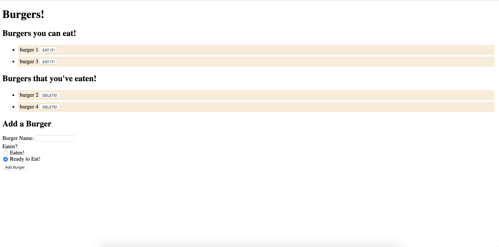

# burgerapp

This application allows you to create new burgers and move them to different lists based on whether they've been eaten or not. The information is stored in a SQL database.

Deployed Application: https://boiling-lowlands-36334.herokuapp.com/
 ***
    
## Table of Contents
[Installation](#Installation)

[Usage](#Usage)
    
[Licensing](#Licensing)
    
***
    
## Installation

## Usage
From the bottom of the page, you can add new burgers. Once a burger has been added, you can then click the button to add it to the eaten list. Once it has been eaten, you can delete it.

    
## Licensing
No License
    
    
***
    
### Email: awhoerman@me.com

    